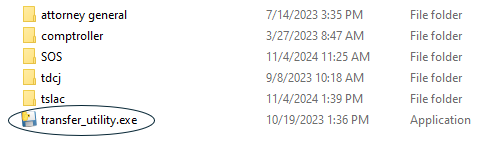
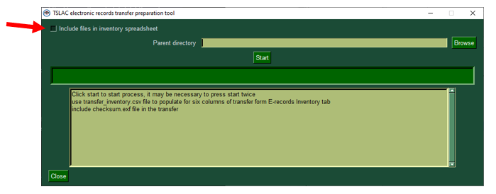
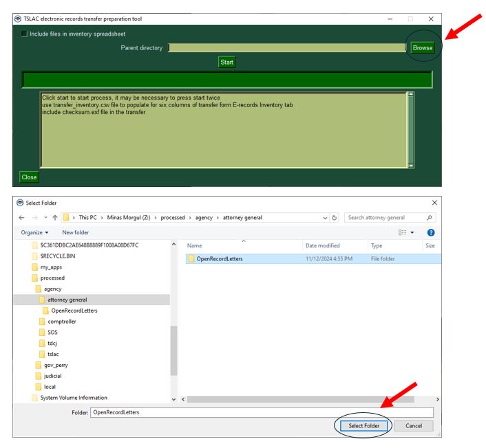
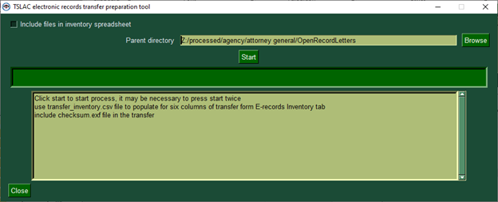
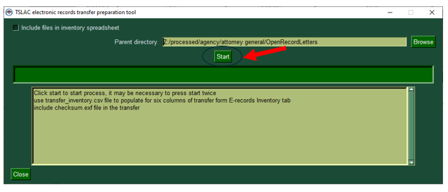
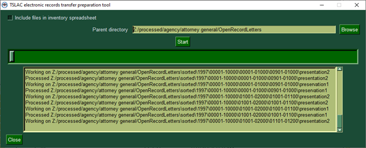
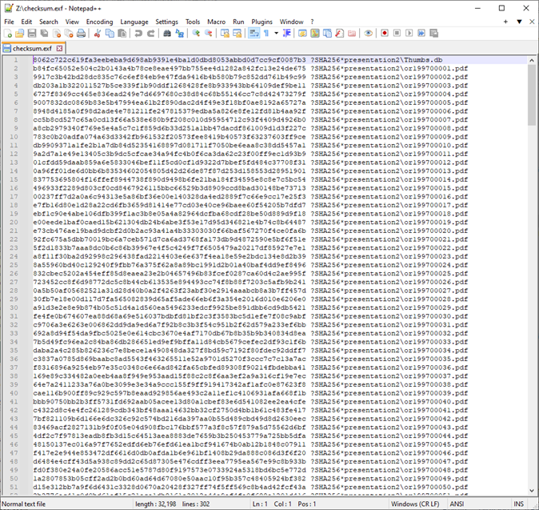
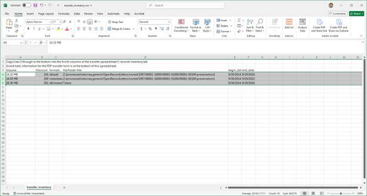
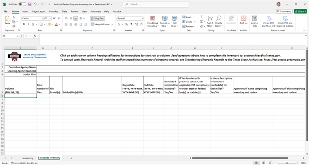
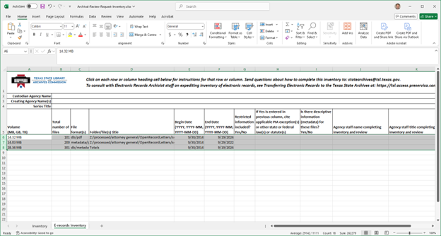

# Electronic Transfer Utility Tool Guide
This is a guide to the tool that can be compiled into an executable using the transfer_utility.py script and it written with the assumption that this compilation has been completed.

## About
This is a visual guide to using the transfer utility developed by TSLAC to assist agencies in meeting the requirements for a transfer of electronic records to the State Archives. It is built with transfer requirements in mind, so agencies are likely to find it helpful, **but use of the tool is not required**. As a reminder, the following four documents are required for any electronic records transfer to TSLAC:
*	Transfer form signed by the agency records management officer
*	Transfer inventory excel spreadsheet with completed E-records Inventory tab
*	A completed item-level inventory of the electronic records being transferred
*	A completed item-level checksum of every electronic record being transferred

The forms and spreadsheets are available at https://www.tsl.texas.gov/arc/stateagency and should be emailed to <a href="mailto:statearchives@tsl.texas.gov">statearchives@tsl.texas.gov</a> to initiate a transfer. 

The tool is meant to facilitate completing the transfer spreadsheet, item-level inventory, and checksum requirements. The item-level checksum does double as an item-level inventory for requirements purposes.

An agency should choose either the archival transfer or the archival review forms and excel spreadsheet based on the records retention schedule. As these forms change periodically, it is recommended that agencies re-download the forms on a regular basis to ensure the most up-to-date version is being used. Screenshots of the forms in this guide may not reflect the most recent exact version of the forms but the gist should be the same.

### Tool Functions
Once a user clicks the file transfer executable file, the tool will go through the entire file structure below the selected folder and read every file. It does not process the content of files, but it will run the raw data through an algorithm called sha256, which creates a unique fingerprint called a checksum for the file at the time the algorithm is run. When the same algorithm is run against the file in the future, no matter where it is stored, if the file has remained unchanged the fingerprint will be the same. Checksum comparison tools are used by TSLAC upon receipt of the transfer to verify what was sent is the exact same file using this fingerprint.

The tool will also extract and aggregate very basic information about the files it is encountering. These are:
1.	File extension
2.	File size
3.	Date last modified

The information is aggregated at the folder-level to generate the date range of the folder contents, show folder size, and types of files in the folder. This information is required for the transfer spreadsheet.

This tool will create two files:
*	checksum.exf
*	transfer_helper.csv

The checksum.exf file is a technical file with checksums for each file that it lists. It doubles as item-level inventory. **Include this in your transfer documentation**.

The transfer_helper.csv file is a temporary spreadsheet with the aggregated folder information to be copied into the first six columns of the formal transfer inventory excel (xlsx) file. **Do not include the transfer_helper.csv in the transfer documentation**.

### Tool Limitations
The tool has specific limitations.
1. The tool will only provide the date of the electronic file, **NOT the date of the content**. For records originating in electronic form this is the information you need. The date provided by the agency should reflect the date of the content. If something was digitized yesterday for a transfer but the actual records digitized were from January 1950 through March 1951, on the transfer inventory excel form a records management officer should provide the date of the original records. Likewise, if the transferred file is an export of aggregated content, such as an email/calendar archive from Outlook, the dates should reflect the date range of the export not the date the export occurred.
2. **The tool can ONLY READ files directly accessible on a user’s computer or network**. Storage services such as Google Drive or Microsoft OneDrive store files in the cloud. When a user opens a file from these services it pulls the file from the cloud to provide the content. This extra step prevents the tool from reading cloud files at the programmatic level for the inventory and transfer spreadsheets.  **In short, users cannot run the tool against files stored in the cloud**.

### Technical Information
As the tool is written in python3 using PySimpleGUI, users wishing to compile this into a Windows executable on their own should do so with pyinstaller using the -wF switch like so `pyinstaller -wF [path to utility]/transfer_utility.py`. The output file will have the same name as the script but can be modified to whatever you wish.

## Step to Utility the Tool
### 1. Opening the tool
The tool is called transfer_utility.exe. Once you’ve downloaded the tool from your shared TSLAC Box folder, go to the downloaded file and double-click on it.

Note that transfer_utility.exe can be moved anywhere, it doesn’t have to stay in the folder you originally downloaded it to.

### 2. Selecting the File Options
Once the tool has started, it will look like the window shown below. 

Checking the Include files in inventory spreadsheet box will add file-level information to the transfer_helper.csv spreadsheet output. This data is already aggregated for the folder-level information that will always be included in the transfer_helper.csv file so using this option will not increase time-in-process. **For large file sets this is not recommended as it will make review of the transfer excel spreadsheet challenging for staff of both agencies**.
### 3. Folder Browse
Click on the Browse button on the right-hand side of the interface and navigate to the folder you wish to process. 

The folder path should show in the Parent directory: text box. This text can be manually modified if necessary, although users should be aware if doing so that folder paths are written with universal formatting of / rather than the windows-specific \.

### 4. Starting the Tool
Once you’ve selected your folder, click on Start button to begin the process. **You will have to click on this twice. You cannot hit enter to start the tool**.

The tool will run and show a progress bar to indicate how far along it is in the process. Note that very large files can take some time, and **the progress bar is based upon number of files not overall size, so if you have large files the tool may look like it is stuck, but it is not**. If the tool gets stuck a user will see an error message and the program will almost immediately close.

Progress information will be printed out to the dialog box below the progress bar.

Note: If your files are stored in the cloud rather than locally, assuming you were able to target the folder, the transfer tool will almost immediately finish and the output checksum.exf file should be incomplete or blank as there are technically no files in the folder to checksum.
### 5. Review the Output
Open the resulting checksum.exf to spot-check it caught all the files involved in the transfer. **Thorough review is not necessary**.

Open the resulting transfer_helper.csv file using MS Excel to check the folder data is correct.

### 6. Copy the Transfer Inventory
Open the MS Excel Archival Transfer Inventory xlsx file. In transfer_helper.csv highlight all rows that have file information.

Copy the data into the xlsx file E-records Inventory tab by highlighting the first blank cell.

Now, paste the content from the csv file.

Note that records managers are responsible for entering the data in the remaining columns and curating the date information in cases of digitization or system exports that don’t reflect the date of the contents (MS Outlook calendar PST files, for example).